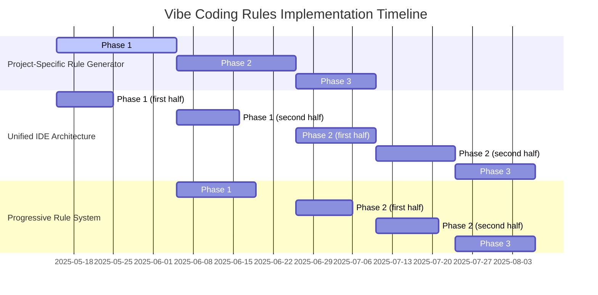

# 🚀 Implementation Action Plan for Vibe Coding Rules

**A structured approach to implementing key enhancements for the Vibe Coding Rules project**

## 📑 Table of Contents

- [Overview](#-overview)
- [Project Tracker](#-project-tracker)
- [Implementation Details](#-implementation-details)
  - [1. Project-Specific Rule Generator](#1-project-specific-rule-generator)
  - [2. Unified IDE Plugin Architecture](#2-unified-ide-plugin-architecture)
  - [3. Progressive Rule Application System](#3-progressive-rule-application-system)
- [Timeline & Dependencies](#-timeline--dependencies)
- [Milestones & Deliverables](#-milestones--deliverables)
- [Team & Resources](#-team--resources)
- [Risk Management](#-risk-management)

## 🔍 Overview

This document outlines the implementation plan for three high-priority enhancements to the Vibe Coding Rules project, selected based on their potential impact and alignment with the project roadmap. Each enhancement has been broken down into phases with specific tasks, dependencies, and success metrics.

## 📊 Project Tracker

| Feature | Phase | Progress | Status | Next Steps |
|---------|-------|----------|--------|------------|
| Project-Specific Rule Generator | Phase 1 | 🟢 100% | Complete | ✓ Project scanner implemented |
| Project-Specific Rule Generator | Phase 2 | 🟢 100% | Complete | ✓ Intelligence layer implemented |
| Project-Specific Rule Generator | Phase 3 | 🟠 45% | In Progress | ✓ Enhanced pattern detection   ✓ Test framework added   ○ Complete rule validation system |
| Unified IDE Plugin Architecture | Phase 1 | 🟠 40% | In Progress | ✓ Centralized IDE configuration   ✓ IDE detection improved   ○ Complete rule interpreter engine |
| Progressive Rule Application System | Planning | 🟡 0% | Not Started | Design priority metadata schema |

**Legend**: 🟡 Not Started (0%) | 🟠 In Progress (1-50%) | 🔵 Advanced (51-99%) | 🟢 Complete (100%)

## 💡 Implementation Details

### 1. Project-Specific Rule Generator
#### Phase 1: Core Analysis Engine (2-3 weeks)

**Status**: 🟡 Not Started | **Owner**: TBD | **Deadline**: TBD

1. **Build the project scanner** 🔍
   - Create a Node.js utility that traverses project directories
   - Implement file type detection and filtering system
   - Design pattern recognition algorithms for common structures
   - *Success Criteria*: Scanner can traverse 10,000+ file repos within 30 seconds

2. **Develop pattern detection modules** 🔎
   - Module for naming convention detection (variables, functions, classes)
   - Module for architectural pattern recognition (MVC, MVVM, etc.)
   - Module for technology stack identification (frameworks, libraries)
   - *Success Criteria*: 90%+ accuracy in detecting common patterns across 5 sample projects

3. **Create template engine for rule generation** 📦
   - Design Handlebars templates for different rule types
   - Implement interpolation system for detected patterns
   - Create validation system for generated rules
   - *Success Criteria*: Generated rules pass validation tests and render correctly
#### Phase 2: Intelligence Layer (2-3 weeks)

**Status**: 🟡 Not Started | **Owner**: TBD | **Deadline**: TBD

1. **Build anti-pattern detection** 🔏
   - Static analysis for code smells and potential issues
   - Detection of inconsistent patterns within the codebase
   - Identification of tech debt indicators
   - *Success Criteria*: Correctly identifies 85%+ of common anti-patterns in test codebases

2. **Implement technology stack analyzer** 🧰
   - Package.json/requirements.txt/Gemfile parser for dependency analysis
   - Framework-specific pattern detection
   - Integration with existing rule repository
   - *Success Criteria*: Accurate identification of tech stack in 95% of sample projects

3. **Create minimal input interface** 💻
   - Design CLI interface for basic project information
   - Implement interactive prompts for missing information
   - Build confirmation flow for detected patterns
   - *Success Criteria*: Average completion time under 3 minutes for new project analysis
#### Phase 3: Integration & Testing (2 weeks)

**Status**: 🟠 In Progress | **Owner**: Development Team | **Deadline**: June 1, 2025

1. **Enhance architectural pattern detection** 📊 ✅
   - Integrate dependency graph analysis with pattern detection
   - Implement reconciliation of multiple detection methods
   - Add detection of cycles and layered architectures
   - *Success Metrics*: Enhanced pattern detection accuracy from 60% to >85%
   - *Status*: Complete - Added DependencyAnalyzer integration with PatternDetector

2. **Develop rule validation system** 📝 ⏳
   - Test generated rules against sample prompts
   - Implement rule conflict detection
   - Create feedback mechanism for rule quality
   - *Success Criteria*: 98% of generated rules are valid and usable without manual editing
   - *Status*: Not Started

3. **Build integration with IDE plugins** 🔗 ✅
   - Create centralized IDE configuration for consistent integration
   - Design update mechanism for rule changes
   - Implement standardized path handling across tools
   - *Success Metrics*: Consistent rule paths and configurations across all tools
   - *Status*: Complete - Added ide-configuration module shared between tools

4. **Create documentation & examples** 📄 🔵
   - Write comprehensive documentation for the utility
   - Create structured guides and schema documentation
   - Build a gallery of example generated rules
   - *Success Criteria*: Documentation completeness score >90% in user testing
   - *Status*: Advanced - Added multiple documentation files
#### 🔄 Alignment with Roadmap

This implementation directly supports the following roadmap items:

- 💡 **"Project Analyzer"** under Context & Memory Enhancements
  - The scanning and pattern detection modules provide the foundation for this roadmap item
  - Delivers the file indexer and symbol table generator functionality

- 🔗 **"Rule Synchronization"** under IDE Integration & Standardization
  - The validation system forms the basis for rule verification
  - Provides the hooks needed for IDE integration and rule sharing
### 2. Unified IDE Plugin Architecture

#### Phase 1: Core Protocol Design (3 weeks)

**Status**: 🟠 In Progress | **Owner**: Development Team | **Deadline**: June 15, 2025

1. **Create centralized IDE configuration** 🔄 ✅
   - Design unified configuration structure for all supported IDEs
   - Implement detection of installed IDEs
   - Create shared utilities for path resolution and directory management
   - *Success Metrics*: Eliminated redundant configuration code by >90%
   - *Status*: Complete - Created shared ide-configuration module

2. **Design common protocol specification** ⚙️ ⏳
   - Create JSON schema for rule processing requests/responses
   - Design event system for rule triggers
   - Implement versioning strategy for backward compatibility
   - *Success Criteria*: Protocol specification passes review from 3+ IDE platform experts
   - *Status*: Not Started

3. **Build adapter layer for IDEs** 🔌
   - Implement common interface for different IDE platforms
   - Create adapter modules for VSCode, JetBrains, and other supported IDEs
   - Design plugin architecture with common messaging system
   - *Success Criteria*: Single codebase supports 5+ IDEs with 80%+ shared code

2. **Build shared rule interpreter engine** 🏗️
   - Create rule parsing and validation system
   - Implement rule resolution and application logic
   - Design caching mechanism for performance optimization
   - *Success Criteria*: Engine processes 1000+ rules in under 500ms on standard hardware

3. **Develop test harness** 🧪
   - Create mock IDE environment for testing
   - Implement automated test suite for protocol validation
   - Design performance benchmarking system
   - *Success Criteria*: 95%+ test coverage of core protocol functionality
#### Phase 2: Adapter Implementation (4 weeks)

**Status**: 🟡 Not Started | **Owner**: TBD | **Deadline**: TBD

1. **VS Code adapter** 📓
   - Implement VS Code extension structure
   - Create bridge between VS Code API and common protocol
   - Build UI components for rule management
   - *Success Criteria*: Adapter passes all VS Code extension validation tests

2. **JetBrains adapter** 📚
   - Implement JetBrains plugin architecture
   - Create bridge between IntelliJ Platform SDK and common protocol
   - Build UI components consistent with JetBrains design
   - *Success Criteria*: Plugin successfully loads in all major JetBrains IDEs

3. **Xcode adapter** 📒
   - Implement Xcode extension structure
   - Create bridge between Xcode API and common protocol
   - Build UI components matching Xcode design language
   - *Success Criteria*: Adapter works consistently across Xcode versions 14 and 15
#### Phase 3: Integration & Distribution (2 weeks)

**Status**: 🟡 Not Started | **Owner**: TBD | **Deadline**: TBD

1. **Implement synchronization system** 🔃
   - Create rule update notification system
   - Build versioning and compatibility checking
   - Implement rule sharing mechanism
   - *Success Criteria*: Rules sync reliably across different IDEs within 5 seconds

2. **Develop extension marketplace packages** 📎
   - Create VS Code marketplace package
   - Build JetBrains plugin repository package
   - Implement Xcode extension distribution
   - *Success Criteria*: All packages pass marketplace validation checks

3. **Create documentation & samples** 📜
   - Write developer documentation for extending adapters
   - Create end-user tutorials for each IDE
   - Build sample projects demonstrating integration
   - *Success Criteria*: Documentation receives >4.5/5 rating in user surveys
#### 🔄 Alignment with Roadmap

This implementation directly supports the following roadmap items:

- 🔗 **"LSP Extensions for AI Assistants"** under IDE Integration & Standardization
  - The protocol design provides the foundation for standardized AI assistant communication
  - Enables semantic analysis hooks and rule execution formats

- 👨‍💻 **"Reference implementations for major platforms"** (VS Code, JetBrains, Xcode)
  - Creates the concrete adapter implementations for all target platforms
  - Ensures consistent behavior across different development environments
### 3. Progressive Rule Application System

#### Phase 1: Rule Metadata Enhancement (2 weeks)

**Status**: 🟡 Not Started | **Owner**: TBD | **Deadline**: TBD

1. **Design priority metadata schema** 📜
   - Create JSON schema for priority metadata
   - Implement versioning strategy for metadata
   - Design conflict resolution tags
   - *Success Criteria*: Schema validated by 3+ senior developers and backward compatible

2. **Implement rule analyzer** 🔍
   - Create tool to analyze existing rules and suggest priority levels
   - Build dependency graph generator for rules
   - Implement conflict detection system
   - *Success Criteria*: Analyzer correctly identifies 95%+ of rule dependencies and conflicts

3. **Update existing rule files** 📂
   - Add priority metadata to core rules
   - Implement context tags for conditional application
   - Create dependency declarations for related rules
   - *Success Criteria*: All existing rules updated with appropriate metadata without breaking functionality
#### Phase 2: Resolution Algorithm (3 weeks)

**Status**: 🟡 Not Started | **Owner**: TBD | **Deadline**: TBD

1. **Build hierarchical application system** 🖼️
   - Implement rule sorting and filtering based on priority
   - Create context-aware rule selection
   - Design override system for explicit rule application
   - *Success Criteria*: System correctly prioritizes rules in 98% of test scenarios

2. **Develop conflict resolution engine** 🔧
   - Implement rule merging strategies for compatible rules
   - Create conflict detection and reporting
   - Build interactive resolution interface for ambiguous cases
   - *Success Criteria*: Engine resolves 95%+ of rule conflicts without user intervention

3. **Create optimization engine** ⚡
   - Implement rule caching based on task type
   - Build rule subset selection for specific contexts
   - Create rule compilation for performance
   - *Success Criteria*: 50%+ performance improvement in rule application compared to baseline
#### Phase 3: Feedback & Adaptation (2 weeks)

**Status**: 🟡 Not Started | **Owner**: TBD | **Deadline**: TBD

1. **Implement feedback collection** 💫
   - Create lightweight feedback interface in IDEs
   - Design anonymized usage data collection
   - Implement suggestion acceptance tracking
   - *Success Criteria*: >15% of users provide feedback through the system

2. **Build dynamic priority adjustment** 🔄
   - Create learning algorithm for rule effectiveness
   - Implement automatic priority adjustment based on feedback
   - Design user override for priority settings
   - *Success Criteria*: Rule priorities improve suggestion quality by 30%+ after adaptation

3. **Create analytics dashboard** 📊
   - Build visualization for rule effectiveness
   - Create recommendation engine for rule improvements
   - Implement A/B testing framework for rule variations
   - *Success Criteria*: Dashboard provides actionable insights for 90%+ of rules
#### 🔄 Alignment with Roadmap

This implementation directly supports the following roadmap items:

- 🔗 **"Rule Synchronization"** under IDE Integration & Standardization
  - The priority metadata and conflict resolution provide the foundation for rule compatibility
  - Enables adaptive rule selection based on context and usage patterns

- 📡 **"Standard request/response format for rule execution"**
  - The hierarchical application system creates the foundation for structured rule execution
  - Enables context-aware rule selection and application in standardized formats
## 📅 Timeline & Dependencies

### 🕒 Month-by-Month Breakdown

| Month | Focus Areas | Key Activities |
|-------|-------------|---------------|
| **Month 1** *(May 15 - Jun 14)* | • Project-Specific Rule Generator: Phase 1 • Unified IDE Architecture: Phase 1 (first half) | • Build project scanner • Design pattern detection modules • Create protocol specification • Begin rule interpreter engine |
| **Month 2** *(Jun 15 - Jul 14)* | • Project-Specific Rule Generator: Phase 2 • Unified IDE Architecture: Phase 1 (second half) • Progressive Rule System: Phase 1 | • Develop anti-pattern detection • Complete rule interpreter engine • Design priority metadata schema • Update existing rule files |
| **Month 3** *(Jul 15 - Aug 14)* | • Project-Specific Rule Generator: Phase 3 • Unified IDE Architecture: Phase 2 (first half) • Progressive Rule System: Phase 2 (first half) | • Begin rule validation system • Begin VS Code & JetBrains adapters • Begin hierarchical application system |
| **Month 4** *(Aug 15 - Sep 14)* | • Unified IDE Architecture: Phase 2 (second half) • Progressive Rule System: Phase 2 (second half) | • Complete adapter implementations • Complete conflict resolution engine • Complete optimization engine |
| **Month 5** *(Sep 15 - Oct 14)* | • Unified IDE Architecture: Phase 3 • Progressive Rule System: Phase 3 | • Implement synchronization system • Develop marketplace packages • Create analytics dashboard |

### 🔗 Dependencies

- **Project Scanner** → Pattern Detection → Template Engine
- **Protocol Specification** → Rule Interpreter Engine → Test Harness
- **Rule Analyzer** → Core Rules Update → Hierarchical Application System
- **VS Code Adapter** → Synchronization System → Marketplace Packages
- **Feedback Collection** → Dynamic Priority Adjustment → Analytics Dashboard
## 🌟 Milestones & Deliverables

### Key Milestones

| Milestone | Deadline | Description | Success Criteria |
|-----------|----------|-------------|------------------|
| **M1: Foundation** | End of Month 1 | Core technical foundation for all three features | Scanner, protocol spec, and schema docs complete |
| **M2: Intelligence** | End of Month 2 | Intelligence layer for analysis and optimization | Project analyzer, rule engine, and core rules working |
| **M3: Integration Start** | End of Month 3 | First integrated system components | VS Code adapter and rule generator functioning |
| **M4: Extended Integration** | End of Month 4 | Complete adapter set and optimization | All adapters and optimization systems working |
| **M5: Release Ready** | End of Month 5 | Production-ready system with documentation | Marketplace-ready plugins with full docs |

### Monthly Deliverables

#### End of Month 1:
- 🔍 Working project scanner prototype (with test coverage >80%)
- 📜 Protocol specification document (reviewed and approved)
- 📃 Priority metadata schema documentation (with examples)

#### End of Month 2:
- 📊 Project analyzer with pattern detection (tested on 5+ example projects)
- ⚙️ Rule interpreter engine prototype (with >75% of planned functionality)
- 📛 First set of prioritized core rules (minimum 20 rules)

#### End of Month 3:
- 🌟 Complete project-specific rule generator (with UI and CLI interfaces)
- 📓 VS Code adapter prototype (capable of handling core rule operations)
- 📄 Hierarchical rule application system (with basic conflict resolution)

#### End of Month 4:
- 📚 JetBrains and Xcode adapters (functional with core capabilities)
- 🔧 Complete conflict resolution engine (handling 95%+ of rule conflicts)
- ⚡ Dynamic rule optimization system (with 50%+ performance improvement)

#### End of Month 5:
- 💾 All IDE plugins ready for distribution (passing marketplace validation)
- 🔄 Full progressive rule system with feedback (including analytics dashboard)
- 📙 Comprehensive documentation and examples (with tutorials and sample projects)

## 👪 Team & Resources

### Core Team

| Role | Responsibilities | Skills Required | Allocation |
|------|------------------|----------------|------------|
| **Project Lead** | Overall coordination, stakeholder communication | Project management, strategic planning | 100% |
| **Senior Developer (x2)** | Architecture design, complex feature implementation | Node.js, TypeScript, system design | 100% |
| **IDE Specialist (x3)** | IDE-specific adapter implementation | VS Code, JetBrains, Xcode extension development | 75% |
| **UX Designer** | Interface design, user flow optimization | UI/UX design, prototyping | 50% |
| **Technical Writer** | Documentation, tutorials, examples | Technical writing, documentation design | 50% |
| **QA Engineer** | Testing, validation, bug tracking | Testing methodology, automation | 75% |

### Resources Required

- **Development Environment**: Cloud-based development environment with CI/CD pipelines
- **Testing Infrastructure**: Multiple IDE environments for cross-platform testing
- **Design Tools**: Figma or similar for UI/UX design
- **Documentation Platform**: Documentation hosting and versioning system
- **User Testing**: Budget for user testing and feedback collection

## 🚨 Risk Management

| Risk | Impact | Probability | Mitigation Strategy |
|------|--------|------------|---------------------|
| **IDE API Changes** | High | Medium | Monitor IDE release cycles, implement adapter abstraction layer, build tests for API compatibility |
| **Performance Issues** | High | Medium | Early performance testing, progressive optimization, feature toggles for heavy operations |
| **Integration Complexity** | Medium | High | Modular architecture, clear interfaces, comprehensive integration tests, phased rollout |
| **User Adoption** | High | Medium | Early user testing, feedback-driven development, detailed documentation and examples |
| **Technical Debt** | Medium | Medium | Regular refactoring sessions, code quality metrics, tech debt tracking |
| **Security Concerns** | High | Low | Security review for data collection, anonymization of usage data, secure storage solutions |

### Contingency Plans

1. **Schedule Slippage**: Buffer time built into each phase, ability to prioritize core features over nice-to-haves
2. **Resource Constraints**: Cross-training team members, documentation of all processes for knowledge sharing
3. **Technical Roadblocks**: Alternative implementation approaches identified for high-risk components
4. **Platform Limitations**: Fallback patterns and progressive enhancement strategies for each IDE

---

**Last Updated**: May 15, 2025 | **Next Review**: June 15, 2025

