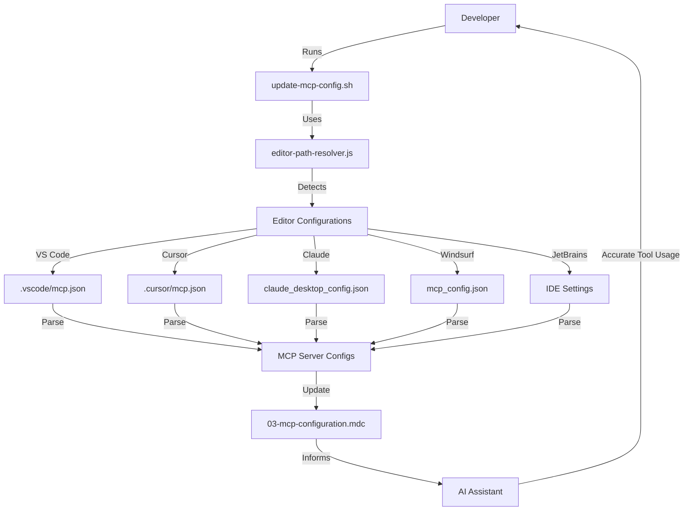

```mermaid
flowchart TD
    A[Developer] -->|Runs| B[update-mcp-config.sh]
    B -->|Uses| C[editor-path-resolver.js]
    C -->|Detects| D[Editor Configurations]
    D -->|VS Code| E[.vscode/mcp.json]
    D -->|Cursor| F[.cursor/mcp.json]
    D -->|Claude| G[claude_desktop_config.json]
    D -->|Windsurf| H[mcp_config.json]
    D -->|JetBrains| I[IDE Settings]
    E & F & G & H & I -->|Parse| J[MCP Server Configs]
    J -->|Update| K[03-mcp-configuration.mdc]
    K -->|Informs| L[AI Assistant]
    L -->|Accurate Tool Usage| A
```
